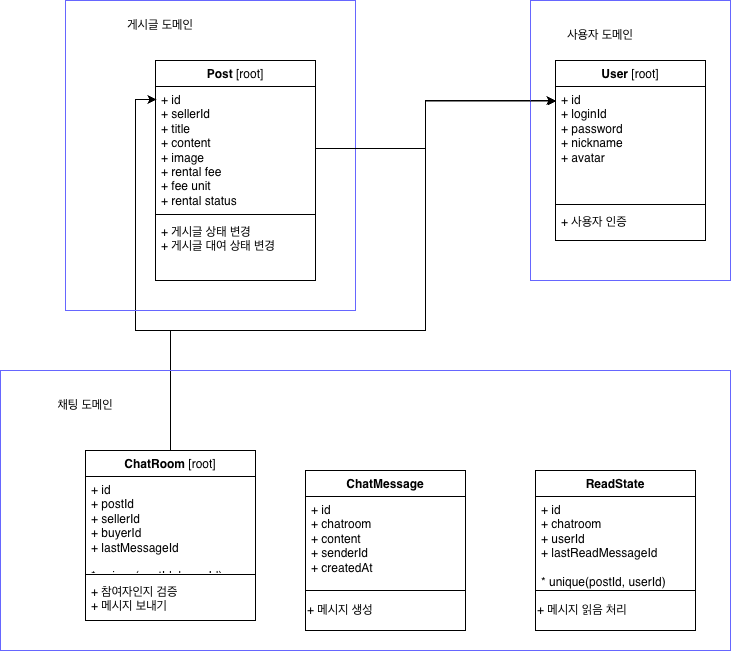
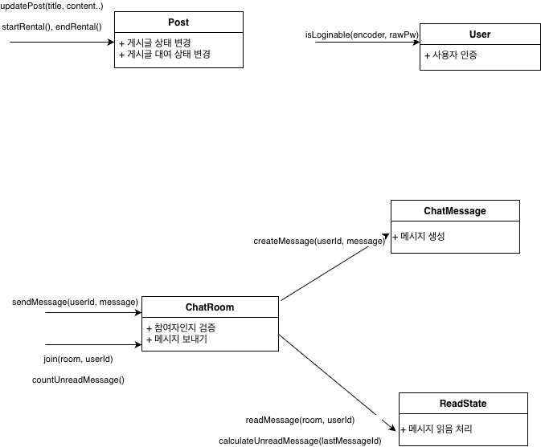
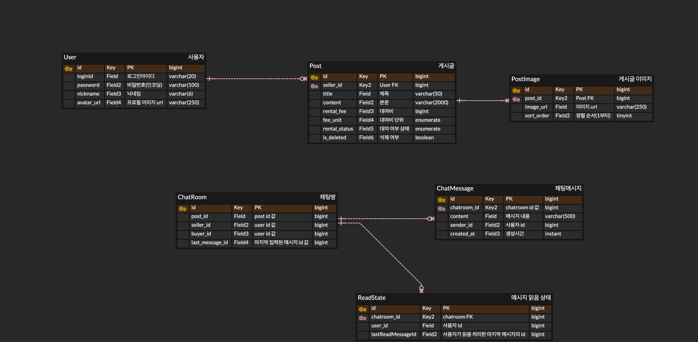

# 설계

## 도메인 분석

### 도메인 불변식 (기준 : 도메인이 유효한 상태인지를 정의하는 조건)
* 사용자
  * 아이디는 필수이다. 중복되면 안된다.
  * 비밀번호는 필수이다.
  * 닉네임은 필수이다.
  * 아바타는 필수이다.

* 게시글
  * 판매자가 필수이다.
  * 제목은 필수이다.
  * 내용은 필수이다.
  * 이미지는 필수이다.
  * 대여비는 필수이다. 1이상의 정수 값이다.
  * 대여비 단위는 필수이다. 정해진 허용 값 중 하나이다.
  * 이미지는 필수이며 최소 1장이 있어야한다.
  * 대여 상태에 대한 값을 가지고 있다.
  * 대여 상태는 판매자만이 변경할 수 있다.

* 채팅
  * 채팅방은 게시글을 알아야한다.
  * 채팅방은 한 개의 게시글에만 속한다
  * 채팅방은 (게시글 식별자, 구매자 식별자)에 대해 유일하다.
  * 채팅방은 판매자와 구매자, 2명으로 이루어진다.
  * 채팅 메시지를 보내는 이는 채팅방 참여자 중 한 명이어야 한다.
  * 채팅 메시지는 빈 값이면 안된다.
  * 읽음 상태는 (채팅방 식별자, 사용자 식별자)에 대해 유일하다.(방마다 2개 존재)
  * 마지막 읽은 메시지는 해당 채팅방에 속해야 한다.
  * 채팅은 생성 순으로 유지된다.

### 도메인 정책 (기준 : 도메인에 영향은 있지만 변경 가능성이 있는 부분들)
* 사용자
  * 아이디는 영어 소문자와 숫자로만 구성되며 5자 이상 20자 이하이다.
  * 비밀번호는 대문자, 소문자, 특수문자, 숫자 최소 한가지씩을 필수로 가져야한다.
  * 비밀번호는 8자 이상 16자 이하이다.
  * 닉네임은 회원가입 시 서버에서 영어와 숫자를 섞은 6자리 무작위 난수를 할당한다.
  * 닉네임은 중복을 허용한다.
  * 아바타는 회원가입 시 입력을 받지 않고 전부 기본 이미지를 사용한다.

* 게시글
  * 제목은 2자 이상 50자 이하이고, 공백만 혹은 이모지는 입력 불가능하다.
  * 제목은 특수문자는 가능하다.
  * 제목은 금칙어에 해당하는 단어는 사용할 수 없다.
  * 내용은 1자 이상 2000자 이하이며 이모지와 html 태그는 입력 불가능하다.
  * 내용은 금칙어에 해당하는 단어는 사용할 수 없다.
  * 대여비는 1억 이하이다.
  * 대여비 단위는 '시간'과 '일' 중 선택할 수 있으며 '시간'이 기본 값이다.
  * 이미지는 최대 5장까지 가능하다.
  * 대여 상태는 '대여 가능'과 '대여중'이 있고 기본은 '대여 가능'이다.

* 채팅
  * 하나의 채팅 메시지는 최대 500자이다. 이모지와 Html 태그는 불가능하다.
  * 채팅방은 게시글이 삭제되어도 유효하다.
  * 채팅은 게시글이 삭제되어도 유효하다.
  * 사용자가 채팅방에 진입하면 해당 시점의 최신 메시지를 모두 읽음 처리한다.

## 도메인 설계 (도메인의 규칙과 경계를 중점으로)

참고 [카카오페이 DDD](https://tech.kakaopay.com/post/backend-domain-driven-design/)

## 객체 설계 (객체의 책임과 객체 간의 메시지를 중점으로)

## ERD 설계 (데이터의 구조와 제약을 중점으로)

